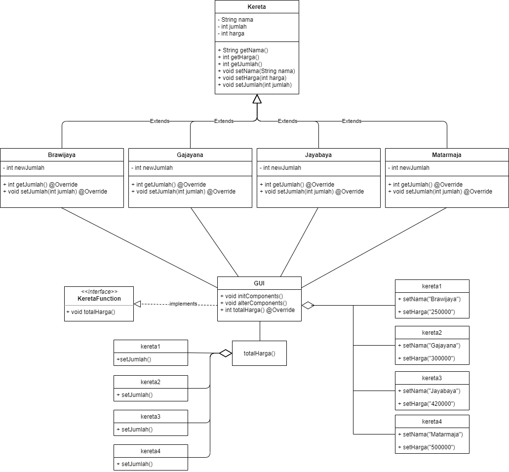

# Pemesanan Tiket Kereta - Kelompok 1

## Anggota Kelompok
- Alvian Rahmadani Saputra (200535626826)
- Akbar Hamaminatu (200535626825)
- Andika Cahya Darmawan Putra (200535626853)

## Project Overview
Proyek ini merupakan implementasi sederhana dari dasar-dasar OOP yang sudah kami pelajari selama mata kuliah Pemrograman Berorientasi Projek berupa sistem pembelian tiket kereta api sederhana. Aplikasi ini dibuat menggunakan NetBeans 12 untuk mendesain GUInya. Konsep OOP yang dicakup yaitu:
* Inheritance
* Enkapsulasi
* Polymorphism
* Abstraction dan Interface

Dengan tambahan exception handling.

## Project Goals
Di dalam repositori ini juga terdapat implementasi non-OOP untuk sistem yang sama. Tujuan pembuatan dua implementasi ini yaitu untuk membandingkan performa dari implementasi OOP dan non-OOP. Kami membuat draf artikel ilmiah yang didalamnya terdapat dokumentasi desain sistem dan komparasi performa.

## System Design
